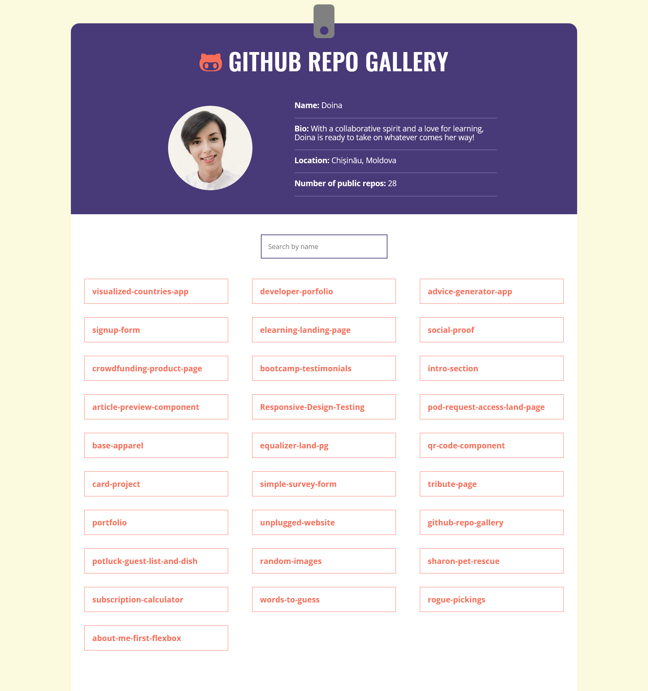
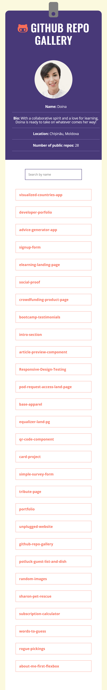

# Skillcrush Project - A GitHub gallery with my repositories
This project is a GitHub repositories gallery that displays a list of repositories and allows users to search for specific repositories and view detailed information about each one.

## Table of contents

- [Overview](#overview)
  - [The challenge](#the-challenge)
  - [Screenshot](#screenshot)
  - [Links](#links)
- [My process](#my-process)
  - [Built with](#built-with)
  - [What I learned](#what-i-learned)
  - [Continued development](#continued-development)
  - [Useful resources](#useful-resources)
- [Acknowledgments](#acknowledgments)


## Overview

### The challenge
The challenge was to create a functional and responsive web application that can fetch data from the GitHub API and display it in an organized and user-friendly manner.

### Screenshot

<div style="display: flex; flex-wrap: wrap; justify-content: space-between;">
  <div style="flex-basis: 50%;">
    
  </div>
  <div style="flex-basis: 40%;">
    
  </div>
</div>


### Links

- Live Site URL: [Live site URL here](https://doileo.github.io/github-repo-gallery/)

## My process

### Built with
This project was built using HTML, CSS, and JavaScript. The main frameworks and libraries used include:
- Font Awesome for icons
- GitHub API for fetching repository data

### What I learned

With this project I learned how to use fetch to retrieve data from an external API, how to filter data based on user input, and how to display selected repository data to the user. I also learned how to handle errors that may occur when fetching data from the API. This code demonstrates important concepts for working with APIs and manipulating data dynamically in a web application.

Here are some code snippets, below:

```js
// Fetch repositories data from GitHub API
const getRepos = async function () {
  try {
    const response = await fetch(apiUrl);
    const data = await response.json();
    return data;
  } catch (error) {
    console.log(error);
  }
};

// Filter repositories based on search input
filterInput.addEventListener("input", function (e) {
  const searchText = e.target.value;
  const repos = document.querySelectorAll(".repo");
  const searchLowerText = searchText.toLowerCase();

  for (const repo of repos) {
    const repoLowerText = repo.innerText.toLowerCase();
    if (repoLowerText.includes(searchLowerText)) {
      repo.classList.remove("hide");
    } else {
      repo.classList.add("hide");
    }
  }
});

// Display repository info when clicked
const displayRepoInfo = function (repoInfo, languages) {
  backButton.classList.remove("hide");
  repoData.innerHTML = "";
  repoData.classList.remove("hide");
  allRepos.classList.add("hide");
  const div = document.createElement("div");
  div.innerHTML = `
    <h3>Name: ${repoInfo.name}</h3>
    <p>Description: ${repoInfo.description}</p>
    <p>Defaul Branch: ${repoInfo.default_branch}</p>
    <p>Languages: ${languages.join(", ")}</p>
    <a class="visit" href="${repoInfo.html_url}" target="_blank" rel="noreferrer nooper">View Repo on GitHub!</a>
  `;
  repoData.append(div);
};

// Handle errors when fetching repository data
const handleErrors = function (response) {
  if (!response.ok) {
    throw new Error(`HTTP error! status: ${response.status}`);
  }
  return response;
};

```

### Continued development

In future projects, I would like to continue improving my skills in working with APIs and handling data, as well as expanding my knowledge of front-end frameworks and libraries.


### Useful resources

- [Resource 1](https://docs.github.com/en/rest?apiVersion=2022-11-28) - I found this useful for understanding how to fetch and handle data from the API
- [Resource 2](https://fontawesome.com/) - This comes in handy when needed icons for different projects


## Acknowledgments

[Skillcrush](https://skillcrush.com/) This project was completed as part of the Skillcrush Front-End Developer career track program.

